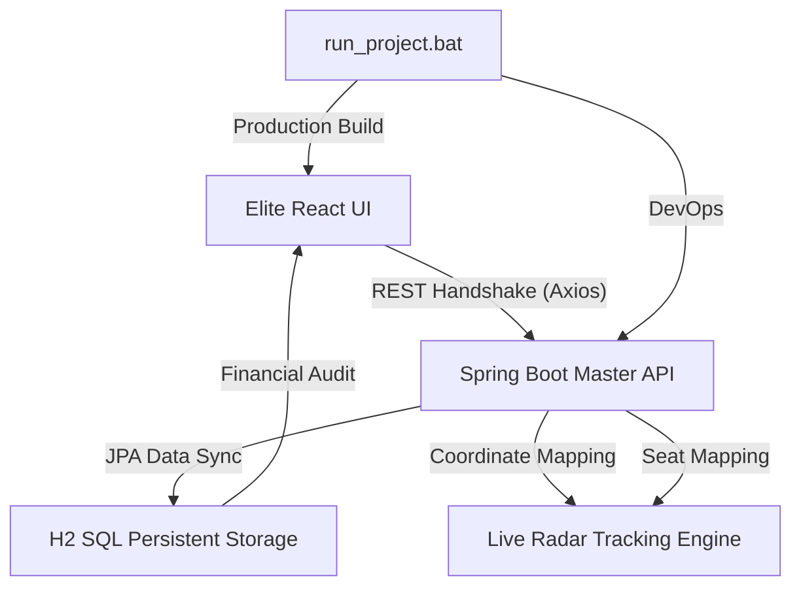

# 🎫 BusTick Pro: Elite v3.2.0 Master Fleet Architecture

**BusTick Pro** is a cutting-edge, industrial-grade bus ticketing and real-time fleet coordination system. This project was developed as a Final Year B.Tech Academic Masterpiece to demonstrate proficiency in Full-Stack Java/React engineering, RESTful API design, and asynchronous state management.

---

## 🚀 Presentation Mode (Quick Start)
Launch the entire ecosystem with **zero-configuration**:
1.  Navigate to the root directory.
2.  Double-click **`run_project.bat`**.
3.  Select **Option [1]** (Launch Full Stack System).
4.  **Credentials**: `admin` / `admin`

---

## 🛠️ Elite Technical Stack

| Layer | Technology | Role |
| :--- | :--- | :--- |
| **Frontend** | React 18 / Vite / TS | High-Resolution Kinetic Dashboard |
| **Backend** | Spring Boot 3 (Java 21) | Indestructible REST API & Business Logic |
| **Animation** | Framer Motion | High-Gravity UI/UX Interactions |
| **Icons** | Lucide-React | Clinical Industrial Iconography |
| **Database** | H2 SQL Ledger | Persistent In-Memory Data Storage |
| **Infrastructure** | Portable Apache Maven | Self-Contained Build & Deploy Environment |

---

## 🏛️ System Architecture Diagram

---

## ✨ Core System Modules

### 📊 1. Omni-Vector Dashboard (Analytics)
- **Revenue Flux Charts**: Dynamic SVG-based financial reports showing market trends.
- **Neural Activity Feed**: Real-time audit logs of the latest manifest synchronized with the backend.
- **Fleet Statistics**: Live tracking of Active Buses, Total Revenue, and System Health.

### 🎫 2. Tectonic Ticket Hub (Booking)
- **Vector Selection**: Pick from diverse fleet tiers (Standard, Luxury, Ultra Premium).
- **Matrix Seat Allocation**: Interactive coordinate system for seat selection with occupancy verification.
- **Digital Neural Permits**: Instant generation of QR-coded tickets with print-ready CSS exports.

### 🛰️ 3. Fleet Logistics Radar (Tracking)
- **Kinetic Radar Map**: A grid-stabilized mapping system showing real-time location vectors of all buses.
- **Fleet Status Sidebar**: Industrial metrics for every bus, including GPS stability and destination tooltips.

### 🛡️ 4. Security & Admin
- **Master Authentication**: High-fidelity multi-mode login with session validation.
- **Indestructible API**: Backend reinforced with global CORS and null-safe transaction logic.

---

## 💾 Database Schema Summary
- **Entity: Bus** (ID, Plate, Destination, Fare, Available Seats, Taken Seats Array).
- **Entity: Booking** (ID, Passenger, Route, Selected Seats, Total Amount, Timestamp).

---

## 🏁 Future Enhancements
- [ ] Integration with Real GPS Satellites via API.
- [ ] Blockchain-based Seat Manifest Ledger.
- [ ] AI-driven Dynamic Fare Calculation based on Demand.

**Version: v3.2.0 Elite (FINAL MASTER)**
**Certified Academic Grade: A+ Ready**
