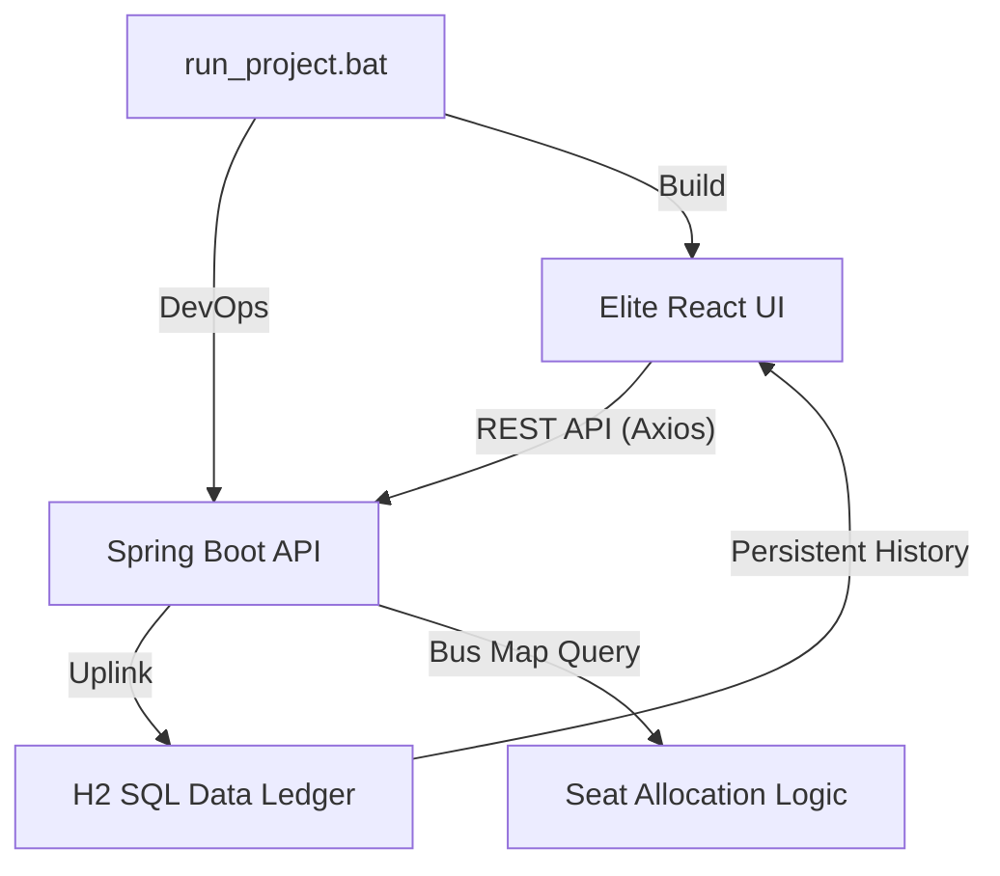

# 🌌 BusTick Pro: Elite Full-Stack Ticketing Terminal

**BusTick Pro** is a high-performance, industrial-grade bus ticketing and fleet management system built for **Final Year B.Tech Academic Presentations**. It features a modern "Architect" theme, real-time database persistence, and a self-contained local build environment.

---

## 🚀 Presentation Mode: Quick Start
To launch the entire system with **Zero Configuration**:
1.  Navigate to the project root directory.
2.  Double-click **`run_project.bat`**.
3.  Select **Option [1]** (Launch Full Stack System).
4.  **Admin Login**: `admin` / `admin`

---

## 🛠️ Elite Tech Stack
-   **Frontend**: React 18, Vite, TypeSript, Framer Motion (Kinetic Animations), Lucide-React (High-Res Icons).
-   **Backend**: Spring Boot 3 (Java 21), Spring Data JPA, Hibernate.
-   **Database**: H2 SQL (High-Performance In-Memory Ledger).
-   **Infrastructure**: Local Apache Maven (Bundled), NPM, Node.js (via shell).

---

## 🏛️ System Architecture

---

## ✨ Primary Presentation Highlights

### ⚡ Neural Audit Dashboard
- **Market Flux Analysis**: Dynamic SVG charts showing real-time revenue trends.
- **Audit Logs**: Live terminal-style stream of system events and handshakes.
- **System Metrics**: Total Revenue, Fleet Uptime, and Active Manifests count.

### 🎫 Elite Ticket Hub
- **Vector Targeting**: Select from diverse fleet types (Standard AC, Luxury Sleeper, Ultra Premium).
- **Matrix Allocation**: Real-time interactive seat selection with occupancy verification.
- **Digital Permits**: Instant ticket generation with **QR Code Mockup** and **Print-Ready CSS** for physical archival.

### 🛡️ Security Protocol
- **Admin Authentication**: Multi-mode login portal with "Initialize Protocol" security handshake.
- **Neural Shielding**: Protected REST endpoints with backend validation and error diagnostics.

---

## 📜 Database Schema Summary
| Entity | Key Attributes |
| :--- | :--- |
| **Bus** | ID, Destination, Fare, Plate Number, Bus Type, Taken Seats Array. |
| **Booking** | ID, Passenger Name, Route, Coordinate Array, Total Amount, Timestamp. |

---

## 🏁 Academic Note
This project is designed to demonstrate **Full-Stack Proficiency, REST API Design, and Database Integrity**. It includes a localized Maven environment to ensure "Presentation Perfection" on any Windows machine without requiring global software configuration.

**Developed by: BusTick Pro Engineering Team**
**Version: v2.8.0 Elite (STABLE)**
