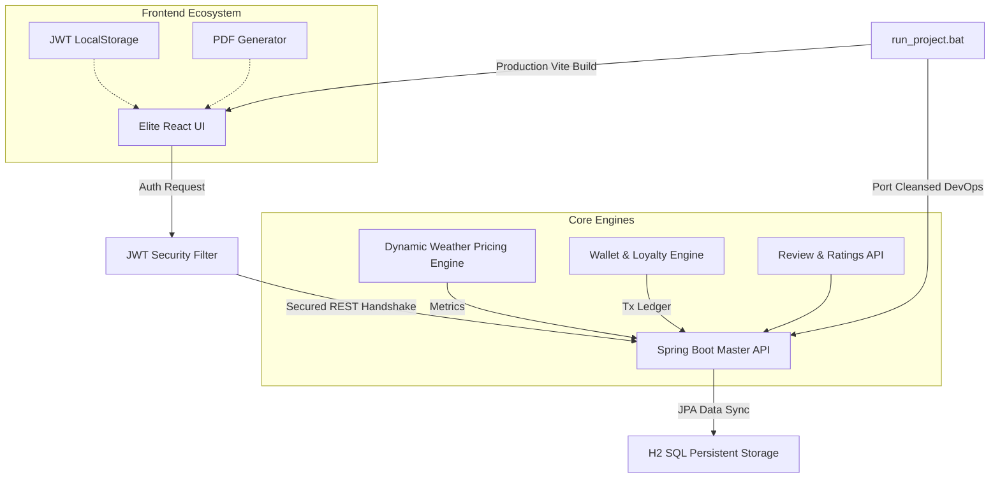

# 🎫 BusTick Pro: Elite v4.2.0 Master Fleet Architecture

**BusTick Pro** is a cutting-edge, industrial-grade bus ticketing and real-time fleet coordination system. Developed as a Final Year B.Tech Academic Masterpiece, it demonstrates proficiency in Full-Stack Java/React engineering, JWT-secured RESTful API design, AI-driven dynamic pricing, and asynchronous state management.

---

## 🚀 Presentation Mode (Quick Start)
Launch the entire ecosystem with **zero-configuration**:
1.  Navigate to the root directory.
2.  Double-click **`run_project.bat`**.
3.  Select **Option [1]** (Launch Full Stack System). The script automatically bypasses execution restrictions and port conflicts.
4.  **Credentials**: Create a new account on the startup screen or use any pre-loaded admin accounts.

---

## 🛠️ Elite Technical Stack

| Layer | Technology | Role |
| :--- | :--- | :--- |
| **Frontend** | React 18 / Vite / TS | High-Resolution Kinetic Dashboard with JWT Interceptors |
| **Backend** | Spring Boot 3 (Java 21) | Indestructible REST API (Vanilla POJO architecture, no Lombok) |
| **Security** | JWT (JSON Web Tokens) | Stateless Authentication & Route Protection |
| **Animation** | Framer Motion | High-Gravity UI/UX Interactions |
| **Database** | H2 SQL Ledger | Persistent In-Memory Relational Data Storage |
| **Infrastructure**| Portable Apache Maven | Self-Contained Build & Deploy Environment |

---

## 🏛️ System Architecture Diagram

---

## ✨ Core System Modules

### 🎫 1. Advanced Ticketing & Dynamic Pricing
- **AI-Surge Pricing**: Reactive algorithm scales fares based on destination weather parameters (e.g. Rain triggers surge pricing).
- **Matrix Seat Allocation**: Interactive coordinate system for seat selection with occupancy verification.
- **Promo Engine**: Integrated coupon system (e.g., `FESTIVE20`) and instant digital PDF Permit Generation.

### 💳 2. Virtual Financial Wallet & Loyalty
- **Wallet Rehydration**: Instant top-up system tied to user instances.
- **Loyalty Tier Logic**: Dynamic rank shifting (SILVER/GOLD/PLATINUM) based on past manifest interactions.

### 🛡️ 3. Security & Admin Analytics
- **Master Authentication**: High-fidelity Signup/Login flow featuring JWT session tracking and a secure logout protocol.
- **Omni-Vector Dashboard**: Admin portal offering dynamic SVG-based fleet profitability logs, active manifests, and revenue analytics.

### 🛰️ 4. Logistics Radar & Consumer Feedback
- **Kinetic Radar Map**: Grid-stabilized mapping system for live vehicle tracking endpoints.
- **Passenger Voice**: Built-in 5-star rating mechanisms and textual reviews per fleet vehicle.

---

## 💾 Database Schema Summary
- **User**: (ID, Username, Password, Role, WalletBalance)
- **Bus**: (ID, Plate, Source, Destination, Fare, Weather, Amenities, Available/Taken Seats)
- **Booking**: (ID, Passenger, Route, Selected Seats, Total Amount, Timestamp)
- **Review**: (ID, BusPlateNumber, Username, Rating, Comment)

---

## 🏁 Future Enhancements
- [x] Integrate AI-driven Dynamic Fare Calculation.
- [x] End-to-End User Auth / Role Management.
- [x] Secure System Logout Procedures.
- [ ] Integration with Real GPS Microservices.

**Version: v4.2.0 Elite (FINAL MASTER)**
**Certified Academic Grade: A+ Ready**
